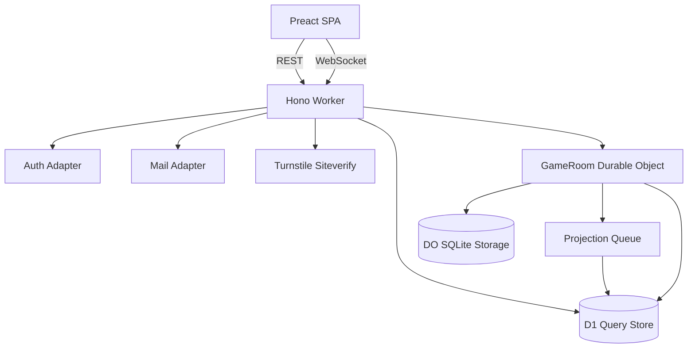

# 将棋対戦アプリ: 設計書

この文書は、[requirements.md](./requirements.md) の要件を満たすための設計を記録する。ユーザーからの元要望は [user-requests.md](./user-requests.md)、初期完全無料での実装方法は [initial-free-implementation.md](./initial-free-implementation.md) を参照する。

## 設計方針

- 対局中の authoritative state は 1 局ごとの `GameRoom` Durable Object に置く。
- D1 は対局中の同期元ではなく、履歴、一覧、検索、棋譜再生の query store として使う。
- クライアントは表示と入力補助を担当し、確定状態は server accepted な event だけで進める。
- 通信断は通常ケースとして扱い、自動再接続と状態復元で対局 UX を守る。
- 無料枠で始められる構成を意識するが、完成形の要件を無料枠へ合わせて削らない。
- Workers runtime の制約を受けやすい認証、メール、将棋ルール処理は adapter と検証ゲートを設ける。
- 設計上の判断は、あとから有料プラン、外部 provider、機能拡張へ移れる境界を残す。
- 過剰な抽象化より、正の所在と責務境界を明確にする。
- 将来の破壊的変更は許容しつつ、履歴欠損、勝敗事故、認可事故、復旧不能につながる設計上の詰みを避ける。

## Extension Boundaries

初期実装では必要以上に層を厚くしない。ただし、将来の差し替えや拡張で対局の中核ロジック全体を巻き込まないように、以下の境界を意識する。

- Auth
  - session、user、permission の取得を `AuthAdapter` に集約する。
  - Better Auth、OAuth、magic link、外部認証基盤を変えても `GameRoom` の着手処理へ認証実装を漏らさない。
- Mail
  - verification、magic link、invite、password reset を `MailAdapter` に集約する。
  - Cloudflare Email Service と外部 provider を差し替えられるようにする。
- Rule Engine
  - 合法手検証、着手適用、局面 hash、棋譜 export を rule boundary に寄せる。
  - `tsshogi` を直接あちこちで呼ばず、将来 `shogiops` や補助実装へ移る場所を見えるようにする。
- Projection
  - D1 への履歴投影、checkpoint、repair、cleanup は authoritative write path から分ける。
  - D1 が遅延または失敗しても対局確定処理へ逆流させない。
- Clock
  - 持ち時間なし、持ち時間プリセット、秒読み、フィッシャー、時間切れ判定は `GameRoom` の clock state machine に閉じる。
  - client clock や UI 表示から勝敗を確定しない。
- Archive / Retention
  - 完了対局の DO cleanup、D1 履歴、R2 archive 候補を分け、保存先追加で棋譜 event の意味を変えない。
- Observability
  - metrics、audit、debug hash は利用者向け棋譜と分ける。
  - 無料枠の消費量、有料化判断、projection lag、reconnect 失敗を後から見えるようにする。

これらは最初から大きな framework にするための抽象化ではない。責務の置き場所を決め、実装が小さいうちは薄い module / adapter で始め、置換が必要になった時点で破壊的変更も含めて拡張できるようにする。

## Initial Implementation Slice

ここでいう縦切りは、機能を削った MVP ではない。完成形の要件を保ったまま、最初に検証すべき責務の接続面を 1 本通す実装順を指す。

最初の縦切りでは、招待対局作成、持ち時間設定、`GameRoom` の生成、Rule Engine 境界での合法手検証、DO storage への event 永続化、D1 projection、再接続時の snapshot / event diff 復元、履歴閲覧までを薄く動かす。これにより、対局 UX の中核である着手確定、履歴保存、通信断復旧、冪等性、無料枠での書き込み量を一度に検証できる。

この段階で、レート戦、観戦、コメント、詳細な棋譜 export、複雑な持ち時間形式をすべて作る必要はない。ただし、`GameRoom`、Rule Engine、Projection、Clock、Auth の境界はこの時点で使い始め、後続機能を足したときに中核ロジックをほどき直さないようにする。

## Initial Zero-Cost Mode

初期完全無料モードでは、Cloudflare Workers Free と無料で使える周辺機能だけで closed alpha / 身内対局を成立させる。詳細は [initial-free-implementation.md](./initial-free-implementation.md) に置く。

初期完全無料モードの前提:

- 公開入口は `workers.dev` とし、custom domain を必須にしない。
- Cloudflare Email Sending は Workers Free では使えないため、初期の本番運用では outbound email を必須にしない。
- public signup は feature flag で閉じ、招待制、OAuth / passkey / 管理者発行アカウントなど、メール送信なしで成立する認証から始める。
- `MailAdapter` は残し、local では dev-log adapter、本番の完全無料モードでは disabled adapter、将来は Cloudflare Email Service または外部 provider に差し替える。
- D1 projection は Queues を必須にせず、`GameRoom` DO storage の outbox + DO Alarm で始められるようにする。Queues は無料枠内で有効化できるが、10,000 operations/day と 24h retention を超える前提にしない。
- R2 は IaC remote state には使えるが、アプリの棋譜 archive は初期必須にしない。
- 無料枠上限へ近づいたら自動課金で粘るのではなく、機能制限、公開範囲縮小、または Workers Paid / 外部 provider への移行判断を行う。

## 推奨スタック

- Runtime / hosting: Cloudflare Workers + Workers Assets
- API: Hono
- Frontend: Preact + `@preact/signals`
- Build: Vite + Cloudflare Vite plugin
- Realtime: Durable Objects + WebSocket Hibernation
- Database: D1
- Async projection: Cloudflare Queues を第一候補にし、無料枠や構成都合で使わない場合は `GameRoom` 内 outbox + DO Alarm で代替する
- Auth: Better Auth + Hono + D1 を候補にしつつ `AuthAdapter` 境界を置く
- Email: `MailAdapter` 境界を置き、Cloudflare Email Service または外部 transactional email provider を差し替える
- Abuse prevention: Turnstile、IP/user 単位の rate limit、招待 URL の期限と取り消し
- Shogi rules: `tsshogi` を第一候補にし、Workers runtime 互換性を検証する

Vite+ は初期本線にしない。Cloudflare Workers runtime、bindings、Workers Assets、SPA fallback の安定性を優先し、まずは Vite + Cloudflare Vite plugin を採用する。Vite+ は check/test/fmt/build 統合の候補として別途検証する。

## 全体アーキテクチャ



### Worker / Hono

- `/api/auth/*`
  - 登録、メール確認、ログイン、ログアウト、セッション取得、パスワードリセットまたは magic link。
- `/api/me`
  - 現在ユーザーとプロフィール。
- `/api/games`
  - 対局作成、招待作成、対局一覧。対局作成時に `timeControlPresetId` または `timeControl` を受け取り、server 側で許可された設定だけを保存する。
- `/api/games/:gameId`
  - 対局メタ情報、現在の公開状態、履歴取得。
- `/api/games/:gameId/join`
  - 招待 URL からの参加。
- `/api/games/:gameId/ws`
  - WebSocket upgrade。認証と参加権限を検証し、該当 `GameRoom` Durable Object へ接続する。
- `/api/games/:gameId/export`
  - KIF / CSA / SFEN / USI などの棋譜出力。

SPA は Workers Assets で配信する。`assets.not_found_handling = "single-page-application"` を使い、アプリ内 route は `index.html` にフォールバックさせる。対局画面は SPA として扱い、Worker 側 SSR は行わない。

## Domain Model

### User

- `users` は対局履歴、招待、監査ログから参照される安定識別子を持つ。
- `users` はメールアドレスなどの個人情報を直接持たない。
- メールアドレス、メール確認状態、認証 provider identity は、auth schema または `user_private_profiles` に分離する。
- 表示名や avatar は公開プロフィールとして `user_public_profiles` に分け、退会時には匿名表示へ置き換えられるようにする。
- メール確認済みでなければ対局作成や参加を制限する。
- 認証方式は実装時に `AuthAdapter` で包む。
- 退会時は `users` row を削除せず、`status = "deleted"` などに変更して対局履歴の参照整合性を保つ。

### Game

- 状態は `waiting`, `active`, `finished`, `aborted` を基本にする。
- 対局者は `black` と `white` の side を持つ。
- 招待対局の作成者は、作成時に `random`, `creator_black`, `creator_white` のいずれかを選べる。既定は `random` とする。
- 招待対局の作成者は、作成時に持ち時間なし、または持ち時間ありのプリセットを選べる。
- `timeControl` は server 側で検証済みの値として game metadata に保存し、`GameRoom` の clock state machine はこの設定だけを参照する。
- `random` の場合、2 人目が参加した時点で server が先後を決定し、`game_players` へ永続化してから `active` に遷移する。
- 対局中の最新局面は `GameRoom` が authoritative に保持する。
- D1 の `games` は一覧・検索用の projection とし、毎手の `current_sfen` 更新に依存しない。

### Game Event

着手、投了、時間切れ、千日手、入玉宣言、システム snapshot など、対局の進行に意味がある出来事を event stream として扱う。

各 event は以下を持つ。

- `eventId`
- `gameId`
- `serverSeq`
- `type`
- `ply`
- `side`
- `actorUserId`
- `clientMoveId`
- `usi`
- `sfenAfter`
- `positionKeyHashAfter`
- `stateHashAfter`
- `prevEventHash`
- `eventHash`
- `elapsedMs`
- `remainingMsBlack`
- `remainingMsWhite`
- `rulesetVersion`
- `schemaVersion`
- `payload`
- `createdAt`

`serverSeq` は durable game event だけを含む単調増加 sequence とする。`ply` は将棋の着手数であり、投了や system event では増えない。

durable game event:

- `gameCreated`
- `playerJoined`
- `gameStarted`
- `moveAccepted`
- `resignAccepted`
- `drawOffered`
- `drawAccepted`
- `drawDeclined`
- `timeoutAccepted`
- `repetitionDraw`
- `perpetualCheckLoss`
- `enteringKingDeclared`
- `gameEnded`
- `systemSnapshot`

ephemeral connection event:

- `connected`
- `disconnected`
- `reconnecting`
- `superseded`
- `ping`
- `pong`
- `foreground`
- `background`

ephemeral event は `serverSeq` を進めず、棋譜再生用の `game_events` にも保存しない。必要なものだけ `audit_events` または WebSocket attachment / presence state に置く。

hash は用途ごとに分ける。

- `positionKeyHash`
  - board、side to move、hands から作る。
  - `ply`、時計、status は含めない。
  - `expectedPositionKeyHash`、千日手、局面一致判定に使う。
- `stateHash`
  - board、side to move、hands、`ply`、clock summary、status から作る。
  - snapshot integrity、debug、障害調査に使う。
- `eventHash`
  - canonical event JSON と `prevEventHash` から作る。
  - archive、projection repair、監査用の hash chain に使う。

canonical board / hands 表現は server 側 rule engine の出力を正とし、持ち駒の並び順、数量表現、手番表現を固定する。`tsshogi` の SFEN 出力を採用する場合でも、`positionKeyHash` には手数を含めないことを test で確認する。性能上必要になった場合だけ stable Zobrist hash を検討する。

## GameRoom Durable Object

1 局につき 1 `GameRoom` Durable Object を割り当てる。`gameId` から Durable Object ID を安定的に引き、着手処理、再接続、presence、終局処理を同じ object に集約する。

### Responsibilities

- WebSocket Hibernation API による接続受け入れ。
- WebSocket upgrade 済みユーザーの接続管理。
- hibernation 復帰時の lazy state load。
- 着手 message の直列化処理。
- 合法手、手番、game status、参加権限の検証。
- `clientMoveId`, `expectedPly`, `expectedPositionKeyHash` による冪等性と不整合検知。
- DO SQLite storage への authoritative event 永続化。
- Queues または DO outbox を使った D1 query store への projection 同期。
- 同期失敗時の DO outbox retry と projection checkpoint 管理。
- `moveAccepted`, `moveRejected`, `stateSnapshot`, `gameFinished` の broadcast。
- 投了、時間切れ、千日手などの終局 event の確定。
- 持ち時間がある対局では次の期限を DO Alarm に保存し、message、resume、alarm handler のいずれでも期限超過を再計算する。
- DO Alarm は 1 object あたり同時に 1 つだけなので、timeout と outbox retry を同じ alarm scheduler で多重化する。

### Hibernation 前提

- 標準 WebSocket の `accept()` ではなく、Durable Object の WebSocket Hibernation API を使う。
- in-memory state は消える前提にする。
- constructor では重い復元をしない。
- constructor で alarm を再設定する場合は、既存 alarm を確認してから行う。hibernation や alarm wake で constructor が再実行されるため、安易な `setAlarm()` で既存 alarm を上書きしない。
- protocol ping/pong は `setWebSocketAutoResponse` で処理し、hibernated object を不要に wake させない。
- 接続ごとの情報は WebSocket attachment に保存できる形へ serialize する。
- WebSocket attachment は小さな per-connection metadata に限定する。永続復元に必要な room state、clock、active control、idempotency、repetition は DO storage から復元する。
- 局面と event log は DO SQLite storage から lazy load する。

## DO Storage と D1 の責務分担

### Authoritative Write Path

着手や終局 event の受理は以下の順で行う。

1. `GameRoom` が message を受け取る。
2. 認可、手番、局面、合法手、冪等性を検証する。
3. DO SQLite storage の transaction で event log、current state、outbox を保存する。
4. DO storage の保存に成功した時点で event を accepted とする。
5. client へ accepted event を broadcast する。
6. projection job を Queues へ enqueue する。Queues を使わない構成では `GameRoom` の outbox flush を予約する。
7. projection worker または `GameRoom` が D1 へ idempotent に同期する。
8. D1 同期に失敗した場合は DO outbox に残し、Queues retry または `GameRoom` の alarm scheduler で retry する。

D1 失敗によって対局 UX を止めない。D1 は履歴と検索の projection であり、対局中の復元は DO storage を優先する。D1 projection は短時間遅延する可能性がある。

### Projection Retry

推奨は、`GameRoom` が accepted event を DO storage に保存した後、Cloudflare Queues へ projection job を送る構成にする。queue consumer は `game_events` の `UNIQUE (game_id, server_seq)` と `UNIQUE (game_id, event_id)` を使って冪等に D1 へ書き込む。D1 書き込みは `INSERT ... ON CONFLICT (game_id, server_seq) DO NOTHING` 相当を基本にし、`server_seq` または `event_id` の conflict 時も既存 row の `event_id` / `eventHash` が一致するなら投影済みとして成功扱いにする。一致しない場合は projection corruption として checkpoint を進めず、`audit_events` と repair 対象にする。

`projection_checkpoints.last_projected_server_seq` は、D1 に存在する最大 `server_seq` ではなく、gap なしで連続して投影済みの最大 `server_seq` とする。例えば 8 まで投影済みで 10 が先に入っていても、9 が未投影なら checkpoint は 8 のままにする。`games` summary、`projectionCompleteAt`、DO outbox pruning は、この contiguous checkpoint だけを根拠に進める。

queue consumer は D1 commit 後に `GameRoom` へ `projectionAck(gameId, contiguousServerSeq)` を送り、DO storage 側の `projection_checkpoints` 更新と outbox pruning を行う。Queues への enqueue、queue delivery、または `projectionAck` に失敗した場合でも、DO outbox には event が残っている。`GameRoom` は後続の着手、再接続、または alarm scheduler で D1 checkpoint を再照合し、未投影 event だけを再送する。D1 側は冪等 constraint を持つため、同じ event が再配送されても重複しない。

無料枠では 1 event = 1 queue message に固定しない。通常は数件単位または短い待機時間で小さく batch し、終局 event は即 flush する。Queues は transport / buffering layer であり、24h retention を超える障害からの recovery source にはしない。DO storage の event log と outbox を復旧元とする。

projection reconciler は以下を行う。

1. D1 の contiguous checkpoint を読む。
2. `game_events` の gap を確認する。
3. DO event log / outbox の final `serverSeq` と比較する。
4. D1 に欠けている event を再 enqueue または direct projection する。
5. final event まで contiguous になった場合だけ `projectionCompleteAt` を確定する。

Queues を採用しない構成では、`GameRoom` 内の outbox を `alarm()` で flush する。ただし DO Alarm は 1 object につき 1 件だけなので、timeout、outbox retry、completed game cleanup を個別 alarm として持たず、`scheduled_tasks` 相当の小さな表に `kind`, `runAt`, `payload` を保存し、次に実行すべき最短時刻だけを `setAlarm()` する。alarm handler は期限到達済み task を処理し、残った最短 task へ再予約する。retry は短すぎる間隔にせず、数秒から始める exponential backoff とし、timeout task を projection retry / cleanup より優先する。

### Completed Game Cleanup

終局後も D1 projection が完了するまでは、DO storage の event log と outbox を authoritative recovery source として保持する。`projection_checkpoints.last_projected_server_seq` が final event の `serverSeq` に到達し、`games.ended_at` と `game_events` の件数が整合したら `projectionCompleteAt` を記録する。

`projectionCompleteAt` から保持期間を過ぎた completed game は、DO storage に最小 summary だけを残すか、必要であれば R2 などへ圧縮 export した上で `room_events` と `outbox` を削除する。Free plan では SQLite-backed DO の 1 object 上限に到達すると write が `SQLITE_FULL` で失敗するため、完了対局の削除/圧縮は運用上の必須処理として扱う。D1 の `game_events` が利用者向け履歴と棋譜再生の正となる。

cleanup は state machine として扱う。

- `FINISHED`
  - final event が DO storage に accepted。
- `PROJECTION_COMPLETE`
  - D1 checkpoint が final `serverSeq` まで gap なしで到達。
  - `games.ended_at`, winner, result reason, final hash が final event と一致。
- `ARCHIVED`
  - 長期保存が必要な場合だけ、R2 などへの archive と checksum 保存が完了。
- `PRUNED`
  - retention 期間経過、dispute / report / moderation hold なし、archive required の場合は verified。

終局直後は D1 projection lag があり得る。利用者には「履歴保存中」として扱い、必要であれば just-finished game に限って `GameRoom` から snapshot / event log を読む fallback API を用意する。

### DO Storage

- `room_state`
  - `gameId`, `status`, `currentSfen`, `positionKeyHash`, `stateHash`, `ply`, `serverSeq`, `sideToMove`, `clockState`, `updatedAt`
- `room_events`
  - authoritative event log
- `outbox`
  - D1 projection 未同期 event
  - `status`, `attemptCount`, `nextAttemptAt`, `lockedUntil`, `lastError`, `updatedAt` を持ち、retry と repair の状態を追えるようにする。
- `projection_checkpoints`
  - `gameId`, `lastProjectedServerSeq`, `projectionCompleteAt`, `lastErrorClass`, `retryAfter`
- `scheduled_tasks`
  - DO Alarm 多重化用の task queue。`timeout`, `outbox_flush`, `cleanup` などを同じ alarm handler で処理する。
- `connections`
  - 必要最小限の接続 metadata。永続認可情報ではなく復元補助に留める

### D1 Query Store

候補 schema:

- `users`
  - `id`, `status`, `created_at`, `updated_at`, `deleted_at`
  - 対局履歴と参照整合性のための安定識別子。メールアドレスや表示名などの個人情報は直接持たない。
- `user_public_profiles`
  - `user_id`, `display_name`, `avatar_key`, `created_at`, `updated_at`
  - 利用者向け表示に使う情報。退会時は `display_name` を退会済み表示へ匿名化し、avatar を削除する。
- `user_private_profiles`
  - `user_id`, `email`, `email_normalized`, `email_verified_at`, `created_at`, `updated_at`, `deleted_at`
  - メールアドレスなどの個人情報を集約する。退会時の削除または匿名化対象にする。
- `auth_accounts`, `sessions`, `verification_tokens`
  - 認証ライブラリ採用時は標準 schema に寄せる。ただし domain `users` にメールアドレスを直接持たせないよう、auth identity と domain user を adapter で対応付ける。
- `games`
  - `id`, `status`, `result`, `result_reason`, `initial_sfen`, `final_sfen`, `time_control_json`, `last_event_seq`, `started_at`, `ended_at`, `created_at`, `updated_at`
- `game_players`
  - `game_id`, `user_id`, `side`, `joined_at`
  - `PRIMARY KEY (game_id, user_id)`
  - `UNIQUE (game_id, side)`
- `game_invites`
  - `id`, `game_id`, `created_by_user_id`, `token_hash`, `status`, `expires_at`, `created_at`, `used_at`
  - token は生値を保存しない。
- `game_events`
  - `id`, `event_id`, `game_id`, `server_seq`, `type`, `ply`, `side`, `actor_user_id`, `client_move_id`, `usi`, `display_text`, `sfen_after`, `position_key_hash_after`, `state_hash_after`, `prev_event_hash`, `event_hash`, `ruleset_version`, `schema_version`, `elapsed_ms`, `remaining_ms_black`, `remaining_ms_white`, `payload_json`, `created_at`
  - `UNIQUE (game_id, server_seq)`
  - `UNIQUE (game_id, event_id)`
  - `UNIQUE (game_id, actor_user_id, client_move_id)` は `client_move_id` がある event にだけ適用する。
- `idempotency_keys`
  - `key`, `user_id`, `route`, `request_hash`, `response_json`, `status_code`, `created_at`, `expires_at`
- `audit_events`
  - `id`, `actor_user_id`, `game_id`, `type`, `correlation_id`, `severity`, `payload_json`, `created_at`
  - 拒否された着手、認証イベント、招待 URL 操作、再接続開始、再接続成功、再接続失敗、rate limit など、利用者向け棋譜に載せない運用・監査イベントを保存する。
- `projection_checkpoints`
  - `game_id`, `last_projected_server_seq`, `projection_complete_at`, `updated_at`
  - `last_projected_server_seq` は max contiguous sequence であり、D1 に存在する最大 sequence ではない。
- `user_stats`
  - `user_id`, `games_played`, `wins`, `losses`, `draws`, `updated_at`

D1 の `games` に毎手 `current_sfen` を UPDATE する設計は避ける。対局中の最新局面は DO storage、履歴再生は `game_events` を正とする。`games` は一覧に必要な status、result、last event、終了時情報、持ち時間設定を保持する。

### Time Control

対局作成時の `timeControl` は、初期実装では `none` と `suddenDeath` を扱う。`none` は持ち時間なしで、時間切れ event を発生させない。`suddenDeath` は双方に同じ初期持ち時間を与え、残り時間が 0 以下になった時点で server が時間切れを確定する。

```ts
type TimeControl =
  | { kind: "none"; presetId: "none" }
  | { kind: "suddenDeath"; presetId: string; initialMs: number };
```

初期プリセットは product 設定として server 側に持ち、任意の client 入力値をそのまま受け付けない。例として `none`, `3m`, `5m`, `10m`, `15m`, `30m` を候補にする。秒読み、フィッシャー、カスタム持ち時間は `Clock` 境界を保ったまま `TimeControl` variant として追加できるようにするが、初回から全てを実装する前提にはしない。

各手の消費時間は `elapsed_ms` に記録する。持ち時間形式が秒読み、フィッシャー、切れ負けのどれであっても、event には着手後の `remaining_ms_black` と `remaining_ms_white` を保存する。持ち時間なしの場合、`remaining_ms_black` と `remaining_ms_white` は `null` とし、履歴再生では時計表示を出さない。時計の進行中 state は `GameRoom` の `clockState` を authoritative とし、D1 は受理済み event の時刻記録と履歴再生に使う。

`clockState` には `timeControl`、次の期限時刻、手番側、残り時間、秒読み状態を保存する。`timeControl.kind === "none"` の場合は `deadlineAt` を持たず、timeout task を予約しない。持ち時間ありの場合は着手受理時に timeout task を `scheduled_tasks` へ保存し、alarm handler は DO storage の `clockState` を読み直して時間切れ event を確定する。alarm が遅延した場合や hibernation から復帰した場合に備え、通常 message と resume の入口でも期限超過を再計算する。

時間管理は server time / `GameRoom` を唯一の正とする。client clock は表示用に限定し、着手受理時の消費時間、秒読み移行、フィッシャー加算、切れ負け判定は `GameRoom` が `now` から計算する。resume snapshot には `serverNow`, `turnStartedAt`, `deadlineAt`, 残り時間、秒読み状態、`timeControl` を含める。持ち時間なしの場合は `deadlineAt` と残り時間を `null` として返す。

timeout は ticking alarm で実装しない。`deadlineAt` だけを保存し、表示は client が `serverNow` と `deadlineAt` から計算する。`move`, `resume`, `alarm` の入口で同じ `advanceClock(now)` を呼び、時間切れ event は idempotent な `eventId` で 1 回だけ作る。timeout と move が境界付近で競合した場合の勝敗規則は、採用する持ち時間ありルールと一緒に Open Question で確定する。

`audit_events` は対局の棋譜再生には使わない。利用者向けの対局履歴は `game_events`、障害調査と不正試行の追跡は `audit_events` に分ける。監査ログは既定 90 日保持とし、長期保存が必要な場合だけ R2 などへ archive して D1 から削除する。

## WebSocket Protocol

### Authentication

WebSocket upgrade の HTTP request で auth session cookie を検証する。`clientInstanceId` は再接続用の client instance id であり、認可の根拠にしない。

全 message で最低限以下を検証する。

- `game.status` が要求された message type を受け付けられる状態である。
- user が対局参加者または許可された観戦者である。
- 観戦者は `resume` や閲覧系 message だけ許可し、対局状態を変更する message は拒否する。
- message schema が valid である。
- payload size が上限内である。
- route / message type ごとの rate limit を超えていない。

対局状態を変更する message では追加で以下を検証する。

- actor が `game_players` に登録された対局者である。
- `resign` や draw offer など、手番に依存しない操作でも actor の side が対局者として確定している。
- actor の session が失効していない。
- connection が該当 side の active control connection である。
- `controlEpoch` が server 側の current epoch と一致する。
- system terminal event は client から直接受け付けず、GameRoom の検証済み処理だけが作成できる。

`move` message では追加で以下を検証する。

- actor の side が現在手番 side と一致する。
- `expectedPly` と server の `ply` が一致する。
- `expectedPositionKeyHash` と server の `positionKeyHash` が一致する。
- `clientMoveId` が未処理、または既処理の同一結果である。
- `usi` が現在局面で合法である。

`clientMoveId` の冪等性 scope は `gameId + side + userId + clientMoveId` とする。client-generated id 単体を信頼せず、別ユーザーや別 side の collision が対局状態に影響しないようにする。

### Connection Lifecycle

同じユーザーが複数タブまたは複数端末で同じ対局を開くケースを明示的に扱う。

- 観戦者は同じユーザーの複数接続を許可する。
- 対局者は side ごとに 1 つの active control connection だけを許可する。
- 同じユーザー/side から新しい control connection が来た場合、server は `controlEpoch` を進め、新しい接続を active とし、古い接続には `superseded` message を送る。
- `superseded` を受けた接続は read-only 表示へ落とすか close する。着手、投了、draw offer などの状態変更 message は拒否する。
- 古い tab から in-flight move が届いた場合は、合法手検証より前に `controlEpoch` 不一致として拒否する。
- `clientInstanceId` は resume と重複表示の補助にだけ使い、接続の優先順位や認可は session と `game_players` で決める。
- client は `superseded` を受けたら「別のタブまたは端末で操作中」と分かる控えめな表示にする。

### Resume

Client:

```json
{
  "type": "resume",
  "gameId": "game_...",
  "clientInstanceId": "client_...",
  "lastSeenServerSeq": 42,
  "lastSeenEventId": "evt_...",
  "lastSeenPly": 41,
  "lastSeenPositionKeyHash": "hash_seen",
  "lastAckedClientMoveId": "move_...",
  "desiredRole": "black",
  "desiredControl": true
}
```

Server:

```json
{
  "type": "resumeDiff",
  "fromSeq": 43,
  "toSeq": 44,
  "events": [],
  "positionKeyHash": "hash_after",
  "serverTime": "2026-06-06T00:00:00.000Z",
  "controlEpoch": 3
}
```

full snapshot が必要な場合:

```json
{
  "type": "resumeSnapshot",
  "snapshot": {},
  "reason": "hashMismatch",
  "serverTime": "2026-06-06T00:00:00.000Z",
  "controlEpoch": 3
}
```

差分復元できる場合は `serverSeq > lastSeenServerSeq` の durable events を返す。client は `serverSeq` が連続している event だけを適用し、gap があれば full snapshot へ戻す。`lastSeenEventId` または `lastSeenPositionKeyHash` が server 側の同一 sequence の event と一致しない場合は、クライアントが保持している局面の取り違えまたは破損として扱い、差分復元ではなく full snapshot を返す。差分が大きすぎる、不整合がある、または state version が古い場合も full snapshot を返す。差分閾値は実測で決めるが、初期値は 50 events 程度を候補にする。

### Move

Client:

```json
{
  "type": "move",
  "controlEpoch": 3,
  "clientMoveId": "move_...",
  "expectedPly": 43,
  "expectedPositionKeyHash": "hash_before",
  "usi": "7g7f",
  "sentAt": "2026-06-06T00:00:00.000Z"
}
```

Accepted:

```json
{
  "type": "moveAccepted",
  "eventId": "evt_...",
  "serverSeq": 44,
  "clientMoveId": "move_...",
  "ply": 44,
  "usi": "7g7f",
  "sfenAfter": "...",
  "positionKeyHashAfter": "hash_after",
  "stateHashAfter": "state_hash_after",
  "elapsedMs": 1200,
  "remainingMsBlack": 598800,
  "remainingMsWhite": 600000,
  "acceptedAt": "2026-06-06T00:00:00.000Z"
}
```

Rejected:

```json
{
  "type": "moveRejected",
  "clientMoveId": "move_...",
  "reason": "stale_position",
  "snapshot": {}
}
```

同じ `clientMoveId` が既に受理済みの場合は、新しい event を作らず、既存の `moveAccepted` と同じ `eventId`, `serverSeq`, `ply`, `positionKeyHashAfter` を返す。これにより、着手受理直後に ack を受け取れなかった client が再送しても pending move を安全に解消できる。

## 通信断・再接続 UX

- WebSocket が切れたら自動再接続する。
- retry は exponential backoff + jitter にする。
- 例: `0s -> 1s -> 2s -> 5s -> 10s -> 30s max`
- `online` event と tab foreground 復帰時は即座に 1 回 reconnect を試す。
- background tab では再接続頻度を抑える。
- Page Visibility API を使い、hidden 中は高頻度 reconnect を避ける。visible 復帰時は即座に resume を 1 回試す。
- 1 秒未満の瞬断は大きく表示しない。
- 2 から 3 秒以上切れている場合だけ控えめに「再接続中」を出す。
- 自分の手番で切れた場合、盤面確認や駒選択はできるが、確定送信は connection restored まで保留する。
- pending move は最大 1 件にする。
- 再接続後、同じ `expectedPly` と `expectedPositionKeyHash` なら 1 回だけ再送する。
- 局面が変わっていれば pending move は自動送信せず、server snapshot に戻す。
- 相手が切断しても即勝敗にはしない。presence と grace period を表示する。
- 長時間戻らない場合の扱いは持ち時間ルールと連動させる。
- hidden tab や通信断によって server authoritative clock は原則停止しない。離席救済を入れる場合は、持ち時間ルールとして明示的に設計する。

REST API retry:

- GET は network error、408、429、5xx に限って retry する。
- POST は idempotency key がある操作だけ retry する。
- 4xx は原則 retry しない。
- 429 は `Retry-After` を尊重する。
- 画面操作 1 回につき retry は 2 から 3 回程度に抑える。

## 将棋ルール

`tsshogi` を第一候補にする理由:

- TypeScript で利用できる。
- KIF / KI2 / CSA / JKF / SFEN / USI などの入出力に対応している。
- 棋譜保存、棋譜再生、export との相性がよい。

検証すること:

- Cloudflare Workers runtime で core API が動くこと。
- Node 固有 API への依存が対局サーバーの bundle に混ざらないこと。
- 1 手の合法手検証が CPU 制約内に収まること。
- 長手数棋譜、持ち駒が多い局面、詰み、千日手周辺で性能と正しさが保てること。
- どのルールを library が直接保証し、どのルールを server 側で補う必要があるかを実装前に表で確認すること。
- `tsshogi` で打ち歩詰め、千日手、連続王手の千日手、入玉宣言法、position hash の扱いに不足がある場合は、補助実装を足すか `shogiops` などの代替 library を比較すること。

対応するルール:

- 合法手検証。
- 手番検証。
- 成り、成らず。
- 持ち駒の打ち。
- 二歩。
- 打ち歩詰め。
- 王手放置拒否。
- 詰み。
- 投了。
- 時間切れ。
- 千日手。
- 連続王手の千日手。
- 入玉宣言法は採用ルールを決めてから実装する。

実装前に作る rule coverage matrix:

- legal move generation: library / server supplement / not supported のどれか。
- illegal move rejection: 二歩、打ち歩詰め、王手放置、行き所のない駒、成り条件。
- terminal detection: 詰み、投了、時間切れ、千日手、連続王手の千日手、入玉宣言。
- notation/export: KIF、CSA、SFEN、USI。
- hash/snapshot: canonical SFEN hash、full snapshot fallback。

## Auth / Email

`AuthAdapter` と `MailAdapter` を明示的に分ける。

### AuthAdapter

- `getSession(request)`
- `requireUser(request)`
- `createUser(input)`
- `startEmailVerification(user)`
- `completeEmailVerification(token)`
- `logout(session)`

Better Auth + Hono + D1 は候補として採用する。ただし、Worker runtime では request ごとの binding、cookie、D1 migration、password hash の CPU 消費を先に検証する。

認証ライブラリが標準 schema として email を user record に持つ場合でも、その record を domain `users` と同一視しない。domain `users` は対局履歴の安定識別子、auth identity / private profile はログインと連絡先の管理、と責務を分ける。`AuthAdapter` は session から domain `userId` を返し、対局、招待、履歴の write path は email を読まなくても動くようにする。

Cloudflare Workers の binding は request context に紐づくため、D1 binding を閉じ込めた auth instance を module-level singleton として共有しない。Hono middleware で request ごとに `AuthAdapter` を作り、同一 request 内では `c.set("auth", auth)` のように再利用する。

初期完全無料モードでは outbound email を必須にしないため、招待制 + passkey、管理者発行アカウント、または無料利用できる OAuth provider を主軸にする。magic link、email verification、password reset は `MailAdapter` 経由で後から有効化できるようにするが、実メール送信が必要な本番 flow は完全無料モードの必須要件にしない。パスワード認証を採用する場合、Workers Free の 10ms CPU 制約に収まるか、hash cost、session validation、D1 access を含めて実測する。収まらない場合は、Workers Paid、外部認証基盤、または passwordless を選ぶ。

CSRF / abuse 対策:

- Cookie は `HttpOnly`, `Secure`, `SameSite=Lax` または可能な範囲で `Strict` を既定にする。session cookie は可能なら `__Host-` prefix、`Path=/`、Domain 属性なしにする。
- state-changing REST route は `Origin` / `Referer` / Fetch Metadata を検証し、必要に応じて CSRF token または session に紐づく signed double-submit cookie を使う。
- WebSocket upgrade は session 検証に加え、`Origin` allowlist、session expiry、対局参加権限、role、invite token validity を検証する。
- WebSocket の state-changing message は handshake 済みであっても、message ごとに session validity、side ownership、active control、`controlEpoch`、schema、payload size、rate limit を検証する。
- Turnstile は登録、magic link 開始、パスワードリセット、招待対局作成など abuse を受けやすい入口に置く。着手や resume のような対局中の高頻度操作には入れない。
- rate limit は Turnstile と別に持つ。例: magic link 開始、招待作成、対局作成、WebSocket connect、state-changing message を user / IP / game 単位で制限する。
- 招待 URL token は 128-bit 以上の乱数にし、D1 には raw token ではなく hash を保存する。期限、使用回数、取り消し状態、seat-specific claim を持たせる。

Security matrix として route / message type ごとに以下を定義する。

- auth required。
- CSRF required。
- Origin required。
- Turnstile required。
- rate limit key。
- session freshness。
- permission check。
- audit log event。

### Account Deletion / PII Retention

退会時は domain `users` を物理削除しない。`users.status` を `deleted` にし、`deleted_at` を設定することで、`game_players`, `game_events.actor_user_id`, `audit_events.actor_user_id` などの参照整合性を保つ。

メールアドレス、auth provider identity、verification token、session、password hash、mail delivery metadata、avatar などの個人情報・認証情報は削除または匿名化する。必要な abuse 対策や監査用途で保持する場合も、生メールアドレスではなく hash、保持期限、目的を明示した別データとして扱う。

履歴画面と棋譜 export は `users.id` ではなく public profile の表示名を解決して表示する。退会済みユーザーは「退会済みユーザー」のような匿名表示にし、過去の `game_events` や audit payload にメールアドレスの生値を残さない。

### MailAdapter

- `sendVerificationEmail(user, url)`
- `sendMagicLinkEmail(user, url)`
- `sendPasswordResetEmail(user, url)`
- `sendGameInviteEmail(user, game)`

Cloudflare Email Service は Workers Paid での本番送信候補にする。Email Service は 2026-06-06 時点で beta のため、実装前に API、制限、deliverability 要件を再確認する。Workers Free では Email Sending が使えないため、完全無料モードでは `DisabledMailAdapter` または local 専用の `DevLogMailAdapter` を使う。実メール送信が必要になったら Cloudflare Email Service、外部 transactional email provider、または既存 domain を使った inbound verification 方式を別途選定する。

### Failure Behavior

- メール送信失敗
  - 登録や magic link 開始 request は失敗として返し、同じ idempotency key の重複送信を避ける。
  - 利用者には「メール送信に失敗したため時間を置いて再試行してください」と表示する。
  - `audit_events` に mail provider、recipient hash、correlation id、error class を保存する。メールアドレスの生値は audit payload に残さない。
- 認証基盤または session 検証失敗
  - REST は 401/403 を返し、対局操作は実行しない。
  - WebSocket upgrade は失敗させ、client は session refresh または再ログインへ誘導する。
  - `audit_events` に failure reason、route、correlation id を保存する。
- 棋譜 export / 棋譜処理失敗
  - 対局の authoritative state は変更しない。
  - 利用者には履歴閲覧を継続できる状態で export 失敗を表示する。
  - 長手数や大きい export は分割または非同期化し、CPU 制約超過を検知できるようにする。
  - `audit_events` に game id、format、error class、correlation id を保存する。
- 再接続失敗
  - client は retry 上限内で再接続し、失敗が続く場合は対局画面に復旧待ち状態を表示する。
  - `audit_events` には `reconnect_started`, `resumed`, `reconnect_failed` を相関 ID 付きで保存する。

## Frontend

### Pages

- 登録。
- メール確認。
- ログイン。
- パスワード再設定または magic link。
- ロビー。
- 招待作成。
- 対局参加。
- 対局画面。
- 対局履歴一覧。
- 棋譜再生。
- 棋譜 export。
- プロフィール。

### Signals

- `currentUser`
- `sessionState`
- `connectionState`
- `gameSnapshot`
- `serverSeq`
- `selectedPiece`
- `legalDestinations`
- `pendingMove`
- `moveList`
- `replayPly`
- `presence`

盤面は固定比率で layout shift しないようにする。将棋盤、持ち駒、成り確認、最終手、合法手候補の見せ方は、キーボードとタッチ操作の両方を考慮する。

対局中の UI は toast を乱発しない。必要なのは、現在の接続状態、送信可能か、相手が再接続中か、局面が復元されたかが控えめに分かること。

## Infrastructure / Deployment

アプリ本体と deploy は Wrangler を主担当にする。production deploy と production D1 migration は GitHub Actions からではなく、deploy 実行者のローカル端末から Wrangler で行う。IaC を本当に書きたい部分だけ Terraform / OpenTofu または Pulumi で管理する。導入する場合でも、同じ Worker、D1、Queue、R2 を Wrangler と IaC の両方で所有しない。

採用する役割分担:

- アプリ本体・deploy: Wrangler。
- IaC を本当に書きたい部分: Terraform / OpenTofu または Pulumi。
- IaC state: Cloudflare R2 remote state。
- CI: test / lint / build のみ。
- apply / deploy: ローカル端末から実行。

GitHub Actions は public repo の無料枠を活かし、test、lint、build に限定する。本番 deploy 用の `CLOUDFLARE_API_TOKEN` は GitHub repository secrets に保存しない。secret、state file、binding 分離の検査は lint / build 内の repository check として扱い、Cloudflare apply / deploy job は置かない。

### Repository Layout / Ownership

初期は public app monorepo にアプリとアプリ付随インフラを同居させる。Cloudflare Workers は bindings、D1 migrations、Durable Object migrations、Queue consumers、Workers Assets がアプリの実行時 interface に近いため、最初から app repo と infra repo を完全分離しない。

推奨 layout:

```text
apps/web
packages/*
infra/cloudflare
migrations
wrangler.jsonc
.github/workflows
```

app monorepo に置くもの:

- Worker / Hono / Preact application code。
- `wrangler.jsonc` と environment ごとの binding 定義。
- `migrations` directory の D1 migrations。
- Durable Object class と Durable Object migrations。
- Queue producer / consumer code と Queue binding。
- R2 bindings とアプリが直接使う bucket 名。
- `infra/cloudflare` の infra code。
- Terraform / OpenTofu / Pulumi の backend 設定テンプレート。
- `.env.example`, `.dev.vars.example`。
- deploy checklist。

repo に置かないもの:

- Cloudflare API token。
- R2 access key / secret。
- `.env`, `.dev.vars`。
- `terraform.tfstate`, `terraform.tfstate.backup` などの Terraform / OpenTofu state file と state backup。
- secret を含む `Pulumi.*.yaml`。必要な場合は secret-free な example file だけを置く。
- Pulumi config の secret 値。
- production D1 dump、個人情報、session secret、mail provider secret、Turnstile secret key。

IaC state は Cloudflare R2 remote state に置く。R2 state bucket は bootstrap resource として扱い、同じ state で自分自身を管理しない。R2 state bucket、account-level token 作成手順、複数アプリ共通基盤、DNS、custom domain、Zero Trust、organization policy が増えたら、それらだけを別 repo または bootstrap layer へ分離する。

将来 repo を分ける場合の境界:

- app repo
  - Worker code、bindings、D1 migrations、DO migrations、Queues、R2 app bucket、`wrangler.jsonc`。
- infra repo
  - account bootstrap、R2 state bucket、DNS、custom domain、Zero Trust、複数アプリ共通 policy、監査・運用基盤。

この境界なら、Cloudflare のアプリ密接リソースを app repo に残しつつ、account / organization / domain 寄りの基盤だけを後から安全に逃がせる。

構築順は private resources first, public routes last を基本にする。

1. Cloudflare account / zone / API token の権限を最小化する。
2. production とは別に dev / staging 用の D1、Queue、R2、secrets を作る。
3. production 用の D1、Queue、R2 など private resources を作る。
4. ローカル端末から D1 migrations を production D1 へ適用する。
5. Durable Object migrations、bindings、Queue producers / consumers、R2 bindings、secrets を `wrangler.jsonc` の環境ごとに設定する。
6. ローカル端末から Worker を public route なし、または制限された staging route で deploy する。
7. migration 状態、binding の向き先、auth、CSRF、Origin、rate limit、Turnstile、admin route の非公開を smoke test する。
8. public signup、`workers.dev`、custom domain、zone route の有効化を最後に行う。

D1 は public internet へ直接公開しない。アプリからの DB 操作は Worker binding 経由に限定し、利用者向け REST / WebSocket message から任意 SQL、migration、maintenance、repair、projection admin を実行できる endpoint を作らない。必要な repair / backfill は、認可済みの運用 command、Queue consumer、または一時的な内部 route とし、production 公開前後で有効化条件と audit log を明示する。

`wrangler.jsonc` の top-level binding が production resource を指したまま preview / staging deploy へ流れないようにする。dev / staging / production は D1 database id、Queue name、R2 bucket、secrets、custom domain を分ける。CI は PR / merge 前の静的検査として、対象 environment と binding 先が分離されていることを確認する。deploy 実行者はローカル deploy 前に、main branch の対象 commit、`wrangler whoami`、`wrangler deploy --dry-run` 相当の出力、migration status、production binding の向き先を確認する。

ローカル deploy の運用:

- deploy は main branch の検査済み commit から実行する。
- production deploy token は deploy 実行者のローカル環境または個人の secret manager に置き、repo、CI log、issue、PR comment へ出さない。
- Cloudflare API token は deploy / migration に必要な scope に絞り、長期固定 token にしない。漏えい時は即時 revoke / rotate できるようにする。
- deploy 前後に commit SHA、Wrangler version、migration version、Worker version、対象 environment をローカル log または手動 release note に残す。
- CI から production deploy しないため、緊急時の rollback もローカル Wrangler command で行う手順を別途用意する。

公開前 checklist:

- `wrangler deploy --env production` が production bindings だけを使う。
- dev / staging deploy が production D1 / Queue / R2 / secrets を参照していない。
- D1 migrations が成功し、schema version がアプリの期待値と一致している。
- `workers.dev` を使わない場合は無効化し、custom domain / route だけを公開入口にする。
- `/api/admin/*`, repair, backfill, debug SQL, raw export などの管理 endpoint が public route から到達不能である。
- WebSocket upgrade と state-changing REST route が Origin / CSRF / auth / rate limit を通らない限り状態変更できない。
- Cloudflare API token は deploy / migration に必要な scope に絞り、アプリ runtime secrets と GitHub Actions secrets とは分ける。

## 無料枠と有料化判断

調査日: 2026-06-06

### Workers Free

- 100,000 requests/day。
- CPU time は HTTP request あたり 10ms。
- Memory は 128MB。
- 外部 subrequests は 50/request。
- Cloudflare 内部 service への subrequests は 1,000/request。
- Worker size は gzip 後 3MB。
- Worker startup time は 1s。
- Static Assets は 20,000 files / Worker version、1 file 25MiB まで。

影響:

- Worker SSR は避ける。
- 大きな棋譜 import/export は分割する。
- password hash、将棋ルール検証、JSON parse は CPU 計測する。
- REST 1 request で D1、DO、Turnstile、mail provider を過剰に呼ばない。
- D1、Durable Objects、Queues など Cloudflare 内部 service への呼び出しは外部 50 枠ではなく内部 1,000 枠を見る。ただし worker invocation の CPU、同時接続、各 service 側の rows read/write limit は別に消費する。

### Durable Objects

- Workers Free でも使える。
- Free では SQLite-backed Durable Objects のみ。
- WebSocket Hibernation を使い、接続中 duration を抑える。
- Worker への WebSocket は initial `Upgrade` connection が Worker request として数えられる。
- WebSocket message 自体は Worker request としては数えない。ただし message によって `GameRoom` Durable Object が起き、DO request、CPU、DO storage read/write は消費される。
- outgoing WebSocket message と WebSocket protocol ping は、アプリ側の永続 event として扱わない。
- SQLite-backed DO storage は Free で account 合計 5GB。
- SQLite-backed DO storage は individual object が Free で 1GB、Paid で 10GB。
- 個別 object の上限到達時は write が `SQLITE_FULL` で失敗する。read と delete は可能なので、完了対局の cleanup で回復できるようにする。
- SQLite-backed DO storage は Free で rows read 5,000,000/day、rows written 100,000/day。
- `setAlarm()` と delete も rows written として消費する。
- 対局中の authoritative write path が DO storage を使うため、D1 だけでなく DO 側の read/write 消費も観測する。

影響:

- 1 局 = 1 `GameRoom` は採用する。
- 全ロビーや全対局を 1 DO に集約しない。
- heartbeat や presence を高頻度に送らない。
- DO storage は authoritative state と復元に必要な event log に絞る。
- 完了対局は D1 projection 完了後に DO storage から event log と outbox を削除または圧縮する。
- 毎手で大きな snapshot を保存せず、event + 必要な checkpoint に抑える。

### D1 Free

- 10 databases/account。
- 500MB/database。
- 5GB/account。
- 5,000,000 rows read/day。
- 100,000 rows written/day。
- Queries per Worker invocation は 50。
- 各 database は query を単一スレッドで処理する。
- index 更新も rows written を追加消費する。

影響:

- index と pagination は必須。
- `games.current_sfen` の毎手更新に依存しない。
- 履歴再生は event stream を読む。
- D1 projection は遅延しても対局中 UX を壊さないようにする。
- 毎手で `game_events` INSERT、必要最小限の集計更新、index 更新が発生するため、1 手あたりの rows written budget を見積もる。
- 1 手ごとに `games` を UPDATE する、複数の統計表を同期更新する、監査ログを過剰に書く、といった write amplification を避ける。
- 大会、観戦コメント、詳細分析など write の多い機能を足す場合は、D1 Free の 100,000 rows written/day を有料化判断に含める。

### Queues Free

- 10,000 operations/day。
- Free tier の retention は 24h。
- 64KB ごとの write、read、delete が operations として数えられる。

影響:

- D1 projection retry の第一候補として使えるが、全 event を無制限に流せる前提にはしない。
- Queue enqueue 失敗や retention 超過に備え、DO outbox を recovery source として残す。
- Free では複数の game event を 1 つの小さな projection message にまとめる。Queue API の batch で複数 message を送るだけでは message 数自体は減らないため、payload 上の event batch として扱う。
- 通常は数件または短時間で flush し、終局 event は即 flush する。
- 無料枠で Queues ops が厳しい場合は、`GameRoom` の alarm scheduler で outbox flush する。

### Free-tier Budget Policy

基本利用は小規模・無料枠を想定する。ただし無料枠上限に合わせて対局体験を削るのではなく、最初から消費量を測れる設計にする。

概算時は以下を 1 手あたり / 1 局あたりで測る。

- DO requests: WebSocket message、resume、alarm、projection ack、cleanup / reconciler。
- DO rows written: event log、room state、idempotency、outbox、scheduled task / alarm、delete。
- D1 rows written: `game_events`、projection checkpoint、games summary、index 更新、audit。
- Queue operations: projection message の write / read / delete と retry。
- Workers CPU: auth、message validation、rule validation、JSON serialize / parse。

Free での利用目標は「closed alpha / 身内利用で安全に遊べること」とし、公開 signup、観戦者増加、password auth、有料対局、継続的に Free 上限の 30-50% へ近づく運用では Paid または外部 provider を検討する。

### Email

- Cloudflare Email Service の Email Sending は Workers Paid plan のみ。
- Workers Paid では月 3,000 通が含まれ、その後は従量課金。
- Cloudflare Email Service は beta なので、API と制限は実装直前に再確認する。
- Workers Free では Cloudflare Email Sending を使えない。完全無料モードでは `DisabledMailAdapter` または local 専用の `DevLogMailAdapter` を使い、実メール送信が必要になったら Workers Paid または外部 provider へ切り替える。

有料化または外部 provider が必要になる判断:

- 本番で Cloudflare Email Service を使いたい。
- password hash や棋譜処理が Free の CPU 制約に収まらない。
- Worker / Durable Object の daily request が上限に近づく。
- Durable Object SQLite storage の rows read / rows written が daily limit に近づく。
- Durable Object SQLite storage の個別 object 1GB または account 5GB に近づく。
- D1 write/read/storage が上限に近づく。
- Queues の 10,000 operations/day または 24h retention が D1 projection retry に足りない。
- 観戦、コメント、レート戦などで WebSocket message が増える。
- 監視、retry、ログ、運用余裕を取りたい。

## Observability

無料枠で小規模に使う前提でも、履歴欠損、勝敗事故、quota 到達を早く見つけるために最低限の metrics を持つ。

- `move_accept_latency_ms`
- `move_reject_count` by reason
- `duplicate_client_move_count`
- `reconnect_count`
- `resume_diff_success_count`
- `resume_snapshot_fallback_count`
- `projection_lag_seq`
- `projection_lag_seconds`
- `projection_gap_detected_count`
- `outbox_pending_count`
- `queue_retry_count`
- `alarm_retry_count`
- `timeout_event_count`
- `auth_latency_ms`
- `csrf_reject_count`
- `websocket_origin_reject_count`
- D1 / DO rows read/write budget
- Queue operations budget

## Quality Gates

実装前または初期実装で必ず確認する。

- Cloudflare Vite plugin + Preact SPA + Hono Worker が Workers runtime で動く。
- Workers Assets の SPA fallback が期待通りに動く。
- Durable Objects WebSocket Hibernation で再接続と hibernation 復帰が動く。
- `setWebSocketAutoResponse` と attachment 復元を使い、ping/pong や per-connection metadata が hibernation を阻害しない。
- durable game event と ephemeral connection event が分離され、`serverSeq` と D1 `game_events` に ephemeral event が混ざらない。
- `positionKeyHash` と `stateHash` の用途が分かれ、千日手、expected position、snapshot integrity の test で一致する。
- `tsshogi` の core API が Workers runtime で動く。
- `tsshogi` の rule coverage matrix を作り、打ち歩詰め、千日手、連続王手の千日手、入玉宣言法、hash/snapshot の不足を明確にする。
- 1 手の合法手検証が CPU 制約内に収まる。
- Better Auth + Hono + D1 が request-scoped auth instance、cookie、migration、session で動く。
- Workers Free で password hash が CPU 制約内に収まるか測り、収まらない場合は magic link/OAuth を本線にする。
- CSRF 防御、Origin 検証、Turnstile 導入箇所が state-changing route と WebSocket upgrade で成立する。
- production 公開前に D1 / Queue / R2 / secrets の binding が環境ごとに分離され、preview / staging が production data store を参照していない。
- public route / custom domain を有効化する前に、migration、secrets、auth、CSRF、Origin、rate limit、Turnstile、admin route 非公開の smoke test が完了している。
- D1、migration、repair、backfill、debug SQL を public internet から直接操作できる endpoint が存在しない。
- GitHub Actions workflow に production deploy job や本番 `CLOUDFLARE_API_TOKEN` 参照がなく、CI は test / lint / build に限定されている。
- ローカル deploy 手順が main branch の検査済み commit、migration status、Wrangler version、Worker version、rollback 手順を確認できる。
- public app monorepo に app 密接リソースを置き、`infra/cloudflare` と R2 remote state の境界が明確である。
- `terraform.tfstate` を含む IaC state file、state backup、secret 入り `Pulumi.*.yaml`、R2 credentials、Cloudflare API token、`.env`, `.dev.vars` が repo に commit されない。
- メール送信 adapter を Cloudflare Email Service と外部 provider で差し替えられる。
- DO storage への accepted event 保存後、D1 projection 失敗を Queues または outbox で復旧できる。
- Queue consumer の D1 projection 成功後、`projectionAck` と checkpoint 再照合で DO outbox を安全に prune できる。
- D1 projection checkpoint が gap を越えず、max contiguous `serverSeq` としてだけ進む。
- projection message が小さな event batch として処理でき、duplicate / out-of-order / ack lost でも repair できる。
- DO Alarm が timeout、outbox flush、cleanup を単一 alarm scheduler で多重化できる。
- clock は server time / DO authoritative で計算され、move / resume / alarm の入口で同じ timeout 判定を idempotent に実行できる。
- state-changing WebSocket message が active control、`controlEpoch`、session validity、side ownership を毎回検証する。
- Security matrix が主要 REST route、WebSocket upgrade、WebSocket message を覆う。
- domain `users` にメールアドレスなどの個人情報が入らず、退会時に private profile / auth identity / session を削除または匿名化しても対局履歴の参照が壊れない。
- completed game の D1 projection 完了確認後、DO storage cleanup が実行できる。
- 持ち時間なし、3 分、5 分、10 分などの初期プリセットで `timeControl` が server 側検証を通り、任意の client 入力値が拒否される。
- D1 と DO storage の 1 手あたり rows read/write、Queues operations、subrequests を計測し、無料枠での想定同時対局数を見積もる。
- 棋譜 export の CPU time を測り、同期処理で扱える手数/形式の上限と、非同期化する閾値を決める。

## Test Plan

- 将棋 rule unit tests
  - 合法手。
  - 非合法手。
  - 成り。
  - 打ち。
  - 二歩。
  - 打ち歩詰め。
  - 王手放置拒否。
  - 詰み。
  - 千日手周辺。
  - 連続王手の千日手。
  - `positionKeyHash` の determinism。
  - `stateHash` の snapshot integrity。
- GameRoom tests
  - move accepted。
  - illegal move rejected。
  - duplicate `clientMoveId` returns the existing `moveAccepted` event without duplicate storage。
  - stale `expectedPly` rejected with snapshot。
  - stale `expectedPositionKeyHash` rejected with snapshot。
  - reconnect diff from `lastSeenServerSeq`。
  - reconnect full snapshot。
  - resume falls back to full snapshot when `lastSeenEventId` or `lastSeenPositionKeyHash` does not match the server event at that sequence。
  - resume falls back to full snapshot when diff has a `serverSeq` gap or exceeds the configured threshold。
  - new player control connection supersedes old connection for the same user/side。
  - old control connection with stale `controlEpoch` is rejected before move validation。
  - superseded connection cannot mutate game state。
  - accepted event persisted in DO storage before D1 projection。
  - D1 projection failure remains in DO outbox。
  - Queue projection is idempotent when the same event is delivered more than once。
  - projection ack prunes DO outbox only through acknowledged `serverSeq`。
  - outbox fallback can replay events when Queue enqueue fails。
  - outbox retry reconciles against D1 checkpoint when projection ack was lost。
  - D1 checkpoint does not advance past a missing `serverSeq` gap。
  - projection reconciler repairs missing D1 events from DO event log / outbox。
  - durable game events advance `serverSeq`; ephemeral connection events do not。
  - hibernation 復帰後も state が復元される。
  - `setWebSocketAutoResponse` handles ping/pong without waking normal application handlers。
  - single DO Alarm scheduler can process timeout, outbox flush, and cleanup tasks without overwriting the next deadline。
  - no-time game does not schedule timeout task and never creates time-expired event。
  - timed preset initializes `clockState` from server-validated `timeControl`。
  - DO Alarm and message/resume deadline recalculation can both produce the same time-expired event idempotently。
  - timeout close to a move is resolved by the server clock rule without duplicate terminal events。
  - completed game cleanup runs only after D1 projection checkpoint reaches the final `serverSeq`。
- Hono API tests
  - auth required routes。
  - game creation。
  - invite join。
  - history retrieval。
  - export。
  - idempotency key 付き POST retry。
  - state-changing routes reject invalid Origin/CSRF token。
  - registration、magic link start、password reset、invite creation の Turnstile failure。
  - invite token is stored hashed, expires, and cannot be reused beyond its policy。
  - route / WebSocket security matrix smoke tests。
  - account deletion removes or anonymizes private profile / auth identity / sessions without deleting the domain user row。
  - account deletion keeps game history and export readable with anonymized user display。
  - admin / repair / backfill / debug SQL routes are not reachable from public routes。
  - rejected move、auth failure、mail failure、export failure、reconnect started/resumed/failed、rate limit が `audit_events` に記録されること。
- D1 tests
  - migrations。
  - index smoke tests。
  - pagination。
  - `users` schema does not include raw email address columns。
  - `audit_events` retention cleanup。
  - `projection_checkpoints` consistency。
  - gap detection for `game_events.server_seq`。
- E2E tests
  - 2 browser context で登録、ログイン、招待、対局開始。
  - 数手指して履歴再生。
  - WebSocket 切断と自動再接続。
  - 着手送信直後の切断と重複防止。
  - 同じ対局を複数タブで開いたとき、新しい control connection だけが着手できる。
  - hidden tab から visible 復帰したときに resume できる。
  - 相手切断時に即終了しない。
- Runtime tests
  - CPU time measurement。
  - Worker bundle size check。
  - `tsshogi` Workers compatibility smoke test。
  - 棋譜 export CPU threshold measurement。
  - D1/DO rows read/write and Queues operations budget smoke test。
  - environment binding smoke test ensures dev / staging / production point to separate D1, Queue, R2, and secrets。
  - CI workflow does not require production Cloudflare deploy secrets。
  - local deploy checklist verifies commit SHA, migration status, Wrangler version, Worker version, and environment before production deploy。
  - repository secret scan blocks Terraform / OpenTofu / Pulumi state files, secret-bearing `Pulumi.*.yaml`, `.env`, `.dev.vars`, Cloudflare API tokens, and R2 credentials。
  - IaC backend smoke test confirms state is stored in R2 remote state, not in the public repository。
  - move acceptance benchmark。
  - projection duplicate / out-of-order / ack lost chaos test。
  - clock / timeout race test。
  - WebSocket Hibernation attachment and auto-response smoke test。

## References

- [Cloudflare Workers + Hono](https://developers.cloudflare.com/workers/framework-guides/web-apps/more-web-frameworks/hono/)
- [Cloudflare Workers Vite plugin](https://developers.cloudflare.com/workers/vite-plugin/)
- [Cloudflare Workers Static Assets / SPA](https://developers.cloudflare.com/workers/static-assets/routing/single-page-application/)
- [Wrangler configuration](https://developers.cloudflare.com/workers/wrangler/configuration/)
- [Cloudflare Workers Infrastructure as Code](https://developers.cloudflare.com/workers/platform/infrastructure-as-code/)
- [Workers limits](https://developers.cloudflare.com/workers/platform/limits/)
- [Workers pricing](https://developers.cloudflare.com/workers/platform/pricing/)
- [Durable Objects overview](https://developers.cloudflare.com/durable-objects/)
- [Durable Objects limits](https://developers.cloudflare.com/durable-objects/platform/limits/)
- [Durable Objects pricing](https://developers.cloudflare.com/durable-objects/platform/pricing/)
- [Durable Objects Alarms](https://developers.cloudflare.com/durable-objects/api/alarms/)
- [Durable Objects WebSockets / Hibernation](https://developers.cloudflare.com/durable-objects/best-practices/websockets/)
- [Cloudflare Queues](https://developers.cloudflare.com/queues/)
- [Cloudflare Queues pricing](https://developers.cloudflare.com/queues/platform/pricing/)
- [Queues Free plan changelog](https://developers.cloudflare.com/changelog/post/2026-02-04-queues-free-plan/)
- [D1 migrations](https://developers.cloudflare.com/d1/reference/migrations/)
- [D1 limits](https://developers.cloudflare.com/d1/platform/limits/)
- [D1 pricing](https://developers.cloudflare.com/d1/platform/pricing/)
- [D1 indexes](https://developers.cloudflare.com/d1/build-with-d1/use-indexes/)
- [Turnstile](https://developers.cloudflare.com/turnstile/get-started/)
- [OWASP CSRF Prevention Cheat Sheet](https://cheatsheetseries.owasp.org/cheatsheets/Cross-Site_Request_Forgery_Prevention_Cheat_Sheet.html)
- [OWASP WebSocket Security Cheat Sheet](https://cheatsheetseries.owasp.org/cheatsheets/WebSocket_Security_Cheat_Sheet.html)
- [Cloudflare Email Service](https://developers.cloudflare.com/email-service/)
- [Cloudflare Email Service pricing](https://developers.cloudflare.com/email-service/platform/pricing/)
- [Cloudflare Email Service limits](https://developers.cloudflare.com/email-service/platform/limits/)
- [Better Auth Hono integration](https://better-auth.com/docs/integrations/hono)
- [tsshogi](https://www.npmjs.com/package/tsshogi)
